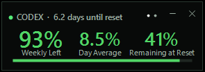
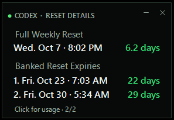

# CodexBar

**A tiny Windows desktop widget for keeping an eye on your weekly Codex limit.**

CodexBar itself requires no login, API key, or account setup—it automatically reuses your existing signed-in Codex session. Its main face shows remaining weekly capacity, average daily usage, and an estimated forecast. Click to switch to the reset-details face, with larger dates and times for the next weekly reset and every available banked reset expiry. It stays out of the way as a compact, draggable widget and continues updating from the Windows notification area.

**Usage overview**



**Reset details**



## Highlights

- Requires no separate login or API key—automatically reuses your existing Codex authentication
- Shows **weekly capacity remaining**, not usage consumed
- Displays the next reset in your local date and time
- Lists the exact expiration date and time of every available banked rate-limit reset
- Changes from green to amber to red as capacity runs low
- Warns with a muted red face and white text when average usage predicts running out before reset
- Switches between usage and reset details with a click; details grow vertically rather than shrinking the text
- Keeps the main face at 290 × 100 logical pixels, with three prominent percentages, labels below them, reset countdown in the title and the progress bar at the bottom
- Restores the compact face's position after viewing larger details or hover content, including at screen edges
- Optionally expands the usage face vertically on hover for larger values and fuller labels, then returns to its compact size when the pointer leaves
- Refreshes automatically at a configurable interval
- Minimizes to the Windows notification area
- Offers a saved Show in taskbar option while the widget remains visible; the notification-area icon stays available
- Supports adjustable transparency and always-on-top mode
- Can launch automatically when Windows starts
- Can notify you by email when weekly capacity resets to fully available
- Actively fetches current limits through Codex's supported local app-server interface
- Roughly 250 KB as a framework-dependent Windows executable

## Using the widget

- **Move:** use the top/title strip as a drag handle. Hovering it never expands the widget, and starting a title-strip drag collapses hover content while keeping the title under the pointer. Existing body dragging is also supported.
- **Switch face:** click the body, press Space or Enter while focused, or choose **Switch face** from the tray menu. Title clicks and dragging do not switch faces.
- **Reset details:** uses a 290-pixel width shared with the main face for readable date and countdown columns. Under **Full Weekly Reset**, the local date/time sits on the left and time remaining on the right. **Banked Reset Expiries** lists numbered date/time rows with matching right-aligned countdowns, without years or duplicate captions. Countdown text is green, or white on the red warning face. Long date rows fit their available space while keeping the countdown aligned to the right. Weekly time keeps decimal days; banked expiry days round to the nearest whole day, with hours shown below one day and expired entries marked explicitly. Countdown values use the latest successful observation; offline banked countdowns show a dash. Two banked resets fit in 290 × 198 logical pixels. Very long lists are limited to the screen height; scroll the face to reach the remaining resets. Offline data is marked in the weekly countdown and last-read footer.
- **Main face:** the large **Weekly Left** percentage sits beside **Day Average** and **Remaining at Reset** percentages at 80% of its font size. All three share the weekly capacity color and have centered labels below them; the title says how long **until reset**. When above pace, the red face uses white percentages and shows **0% Remaining at Reset**. Hover content includes the estimated time until exhaustion, and the reset-details face expands separately for readable dates.
- **Hover expansion:** enable **Expand on hover** from the right-click menu. Body entry waits 350 ms before expanding to 290 × 236; leaving the body (including moving to the title strip) waits 450 ms before collapsing. Body reentry cancels collapse. Open menus postpone changes. Title-strip dragging shrinks immediately once movement crosses the drag threshold; hover expansion stays suppressed after release until the pointer leaves and reenters the body. This option starts off and persists between launches.
- **Position:** larger faces fit inward when near a screen edge, then return to the compact face's original location. Body dragging moves that saved location by the same distance. Title-strip dragging collapses under the pointer and sets the new compact position directly. The saved startup position is the compact location.
- **Taskbar:** choose **Show in taskbar — On/Off** from the right-click menu. Off hides the running-window button while leaving the widget visible. The choice persists and applies when restoring the widget from the tray. New or missing settings default to Off; an explicit saved choice is retained. The notification icon and pinned launch shortcut remain available; a pinned shortcut remains visible as a launcher.
- **Start with Windows:** enabled automatically on the first launch of this build for the current Windows user, pointing to the executable you launched. Turning it Off in the menu is remembered and is not reversed on later launches. Startup failures show a tray warning. Keep the executable at its launch location while startup is enabled.
- **Minimize to tray:** click `—` to hide both the widget and its taskbar button while CodexBar keeps updating in the notification area.
- **Restore:** double-click the CodexBar notification icon, or choose **Show widget** from its menu.
- **Tray menu:** right-click either the widget or its notification icon.
- **Close:** clicking `×` minimizes CodexBar to the tray so it can keep updating.
- **Quit:** choose **Exit** from the tray menu.

The percentage is the capacity still available. For example, if Codex reports 10% used, CodexBar displays **90% left**.

### Usage pace

**Average / day** is the percentage of the weekly pool used divided by elapsed time in the current seven-day cycle. The cycle start is inferred as seven days before the reported reset time. Partial days and inactive days are included; this is not a measurement of today's usage or a daily allocation enforced by Codex.

The forecast assumes that this average continues. For example, 10% used after three days means 3.3% per day and about 77% left at reset. Using 50% after two days means 25% per day, with about two days of capacity remaining and five days until reset.

- Forecasts are withheld during the first six hours of a cycle. Exhausted capacity is still shown immediately.
- Both faces turn muted red when projected total usage exceeds 100.5%, or capacity is exhausted. The warning clears at 99.5% or less; this small buffer prevents flickering near the boundary.
- These estimates concern the current weekly pool. They do not assume that a banked reset will be redeemed or that paid credits will extend it.
- While offline, the last successful weekly percentage and daily average stay visible with an **Offline** label in the title. The compact forecast becomes a dash; the last reading's time also appears in the title. The live warning colour is cleared.
- A reset or changed reset timestamp recalculates the pace. Invalid or expired window timing does not produce a forecast.

## Settings

Preferences persist between launches.

| Setting | Options | Default | What it does |
|---|---|---:|---|
| Refresh interval | 5 sec, 15 sec, 30 sec, 1 min, 5 min | 15 sec | Controls how often CodexBar requests the current live account limit. |
| Transparency | 100%, 90%, 80%, 70%, 60%, 50% opaque | 90% | Adjusts the entire widget's opacity. |
| Expand on hover | On / Off | Off | Expands the usage face vertically for larger labels while hovered. |
| Always on top | On / Off | On | Keeps the widget above ordinary windows. |
| Show in taskbar | On / Off | Off | Shows or hides the running-window taskbar button while the widget is visible. |
| Start with Windows | On / Off | On at first launch | Adds or removes CodexBar from the current user's startup applications; a later Off choice is retained. |
| Usage notifications | SMTP | On, unconfigured | Sends one alert when observed weekly usage returns to zero and SMTP is configured. |
| Send test alert | — | — | Exercises the configured notification delivery without changing reset tracking. |
| Refresh now | — | — | Requests the current live account limit immediately. |

Preferences are stored at:

```text
%LOCALAPPDATA%\CodexBar\settings.json
```

## Notifications

CodexBar can notify you by email when weekly capacity resets to fully available. Open **Usage notifications…** from the tray menu, enter a notification address and your mail provider's SMTP details, and CodexBar sends one message automatically when it observes the weekly usage return to zero.

You may be able to receive the alert as a text by using an email-to-SMS or email-to-MMS address supplied by your mobile carrier. Ask your carrier or search its official support site for **email-to-text gateway** and your plan name. The address is often based on your full phone number and a carrier-specific domain, but formats and availability vary. Send a normal test email to the address first, then use **Send test alert** in CodexBar.

For Gmail SMTP, use `smtp.gmail.com`, port `587`, enable SSL/TLS, and enter your full Gmail address as the SMTP user. Google requires 2-Step Verification before you can [create a 16-digit app password](https://support.google.com/mail/answer/185833?hl=en); use that app password in CodexBar instead of your normal Google password. The app-password option may be unavailable for some managed, security-key-only, or Advanced Protection accounts.

## How it works

CodexBar uses the authenticated Codex installation already on your computer:

1. Starts Codex's local `app-server` in the background using the installed Codex executable.
2. Calls the supported `account/rateLimits/read` method at the selected refresh interval. Codex owns authentication, token refresh, and the upstream request.
3. Selects the account-wide `codex` limit, ignoring separate model-specific pools.
4. Finds the seven-day window (`10080` minutes), whether Codex reports it as the primary or secondary limit.
5. Displays `100 − used_percent`, the weekly reset, and any available banked-reset expirations in your local time zone.

This means CodexBar does not scrape the UI, automate a browser, read authentication tokens directly, or maintain a second login. The default refresh interval is 15 seconds, but you can change it from **Refresh interval** in the tray menu. Each selected interval performs a real authenticated rate-limit read—for example, selecting 5 seconds sends one read every 5 seconds, while selecting 5 minutes sends one every 5 minutes. If a request fails, the widget clearly labels the last successful live value as **Offline** while it retries.

## Privacy and security

- No Codex credentials, access tokens, or API keys are requested or stored.
- Authenticated requests are delegated to the official local Codex app-server; CodexBar never handles the underlying token.
- Only account-wide weekly limit fields are used; conversation content and local session files are never read.
- If SMTP delivery is configured, its address, host, port, and user are stored in the local settings JSON. The SMTP password is protected with Windows Data Protection API for the current Windows user and is never written there as plaintext.

## Installation

### Download a release

Download `CodexBar.exe` from the repository's **Releases** page and run it. The lightweight build requires the [.NET 10 Desktop Runtime](https://dotnet.microsoft.com/en-us/download/dotnet/10.0). A portable release may also be provided for computers without .NET installed.

Windows may show a SmartScreen warning for unsigned community-built executables. Choose **More info → Run anyway** only if you downloaded the file from a release you trust.

### Build it yourself

Requirements:

- Windows 10 or Windows 11, x64 or ARM64
- .NET 10 SDK or newer
- Codex app or CLI used at least once

Clone the repository using GitHub's **Code** button, then from PowerShell:

```powershell
cd codex-bar
.\build.ps1
```

The lightweight executable is written to `dist\CodexBar.exe`.

To bundle the .NET runtime into a larger, standalone executable:

```powershell
.\build.ps1 -Portable
```

For Windows on ARM:

```powershell
.\build.ps1 -Runtime win-arm64
```

## Troubleshooting

### “Open Codex and sign in”

Open Codex and sign in. CodexBar will reuse that authenticated session on its next refresh. The installed Codex version must support app-server account methods.

### The number has not changed

Choose **Refresh now** to request the live limit immediately. If the widget says **Offline**, open or update Codex and confirm that you are signed in; live access will be retried automatically.

### The widget disappeared

Look for the CodexBar icon in the notification area, including the overflow menu, and double-click it. Only **Exit** fully closes the application.

### The lightweight EXE asks for .NET

Install the [.NET 10 Desktop Runtime](https://dotnet.microsoft.com/en-us/download/dotnet/10.0), or rebuild/download the portable version.

## Project structure

```text
CodexBar.csproj    Windows Forms project configuration
WidgetForm.cs      Widget UI, tray menu, rendering, and refresh behavior
UsagePace.cs       Weekly-cycle average and forecast calculation
CodexAppServerClient.cs  Live authenticated Codex rate-limit client
AppSettings.cs     Persistent preferences and Windows startup setting
build.ps1          Lightweight and portable publishing script
CHANGELOG.md        Version history and release notes
assets/            Product screenshots
                    Multi-resolution Windows application icon
```

## Limitations

- Windows only.
- The lightweight build depends on the .NET 10 Desktop Runtime.
- It reports the account-wide weekly Codex pool, not separate model-specific limits.

## Local verification

Run the isolated calculation and actual-form checks with:

```powershell
dotnet run --project tests/CodexBar.Checks -c Release -- artifacts/preview-checks
```

The checks render sample faces to the optional output folder. They do not contact Codex, send notifications, or save preferences. Confirm the live executable's click, drag, tray controls and appearance separately after building.

## License

CodexBar is licensed under the GNU General Public License, version 3 only (`GPL-3.0-only`). See [LICENSE](LICENSE) for the full license text.
